# Glass — Architecture & Runtime Guide

A code-verified, reverse-engineered walkthrough of how **Glass** (by Pickle, a fork of
[CheatingDaddy](https://github.com/sohzm/cheating-daddy)) actually works at runtime: its
processes, windows, the Ask (vision) and Listen (audio/STT) features, the AI provider layer,
data persistence, and what you do — and don't — get when you run it as-is.

Every non-obvious claim below carries a `file:line` reference so you can jump to the source.
This document complements three narrower references already in the repo:

- [`README.md` → "How It Works"](README.md#how-it-works) — the short version
- [`docs/AUDIO_AND_STT.md`](docs/AUDIO_AND_STT.md) — the deep audio/STT reference (provider matrix, AEC, resilience)
- [`docs/DESIGN_PATTERNS.md`](docs/DESIGN_PATTERNS.md) — the contributor-facing pattern guide

Diagram sources live in [`docs/diagrams/`](docs/diagrams/) (`.mmd`); they are embedded inline
below and also renderable to SVG via `docs/diagrams/render.sh` / `render.ps1`.

---

## Table of contents

- [0. TL;DR — the questions everyone asks first](#0-tldr--the-questions-everyone-asks-first)
- [1. What Glass is](#1-what-glass-is)
- [2. Process & window topology](#2-process--window-topology)
- [3. The window model & "invisibility"](#3-the-window-model--invisibility)
- [4. IPC architecture](#4-ipc-architecture)
- [5. App lifecycle](#5-app-lifecycle)
- [6. The Ask (vision) feature](#6-the-ask-vision-feature)
- [7. The Listen (audio / STT) feature](#7-the-listen-audio--stt-feature)
- [8. Incremental summarization](#8-incremental-summarization)
- [9. AI provider abstraction & model state](#9-ai-provider-abstraction--model-state)
- [10. Gemini failover](#10-gemini-failover)
- [11. Data, persistence & auth](#11-data-persistence--auth)
- [12. Local AI (Ollama + Whisper)](#12-local-ai-ollama--whisper)
- [13. Prompts & Ask modes](#13-prompts--ask-modes)
- [14. Build, packaging & platform support](#14-build-packaging--platform-support)
- [15. "If I run it as-is"](#15-if-i-run-it-as-is)
- [16. Known limitations & gotchas](#16-known-limitations--gotchas)
- [17. File map — where to look](#17-file-map--where-to-look)

---

## 0. TL;DR — the questions everyone asks first

**How does the app work, in one breath?**
Glass is an Electron desktop app that floats a small always-on-top toolbar over everything
else. It has two features: **Ask** (press a hotkey → it grabs one screenshot of your screen
and asks an LLM about it, streaming the answer back) and **Listen** (it transcribes your
microphone and the other party's system audio in real time and writes rolling summaries).
Everything is stored locally in SQLite, or in Firebase when you sign in. The desktop windows
are excluded from screen recordings by default, which is what makes it "invisible."

**Does the screen image have to be static for it to work?**
No. There is no requirement that the screen hold still. Each Ask press captures a **single,
fresh JPEG of the current screen at that instant** (`askService.js:255`, `captureScreenshot`
at `askService.js:39`). The model sees one frozen frame — whatever was on screen the moment
you pressed the key. It does not watch a live video feed and does not need the screen to
remain unchanged.

**Does it remember past screens, or must the screen be open at the right moment?**
The screen must be showing what you care about **at the moment you press Ask** — that frame is
the only image sent. The model does **not** recall earlier screenshots. Glass *stores* every
Q&A in the `ai_messages` table, but that history powers the transcript UI, **not** the next
prompt: `sendMessage(userPrompt, conversationHistoryRaw=[])` accepts a history argument
(`askService.js:219`), yet the IPC handlers that call it never pass one
(`featureBridge.js:134`, `:135-144`). So each Ask is independent from the LLM's perspective.

**Does it take several screenshots?**
No — **exactly one per Ask press**. There is no screenshot queue and no background capture
loop. (A `screenshotInterval` value lingers in settings defaults at `settingsService.js:207`
and `startCapture(screenshotIntervalSeconds = 5, …)` at `listenCapture.js:417` carries a
vestigial parameter, but **neither drives any periodic screenshotting** — the Listen pipeline
is audio-only.)

**If I run it right now, do I get "Speaker Diarization"?**
You get **source attribution, not voice diarization** — and only after configuring a provider.
Glass runs two separate STT sessions and tags text by **which audio channel it arrived on**:
your microphone is `"Me"` (`sttService.js:82`), the system/loopback audio is `"Them"`
(`sttService.js:109`). It never analyzes voice characteristics. So a Zoom call cleanly splits
"interviewer vs you" because the other person comes through system audio — but **two people
sharing your one microphone are both tagged `"Me"`.** And nothing transcribes at all until you
have both an LLM key and an STT key configured (`modelStateService.areProvidersConfigured`,
`modelStateService.js:437-455`).

**Does transcription + that speaker split work on Windows too?**
**Yes.** Windows captures system audio via Electron's **native loopback** (the handler at
`index.js:175-183` resolves `getDisplayMedia` to `audio: 'loopback'`), so you get both `"Me"`
and `"Them"` with no extra binary. macOS uses a bundled `SystemAudioDump` native binary
instead. **Linux is the exception** — loopback is disabled (`listenCapture.js:488`), so on
Linux you only ever get `"Me"`.

### Capability matrix (run-as-is)

| Capability | macOS | Windows | Linux |
|---|---|---|---|
| Ask (screenshot → LLM) | ✅ `screencapture` + `sharp` | ✅ `desktopCapturer` | ✅ `desktopCapturer` |
| Listen — `"Me"` (mic) | ✅ | ✅ | ✅ |
| Listen — `"Them"` (system audio) | ✅ `SystemAudioDump` binary | ✅ native loopback | ❌ disabled |
| Acoustic echo cancellation (AEC) | ✅ Rust/WASM | ✅ Rust/WASM | ❌ |
| Voice diarization (who-is-who by voice) | ❌ never | ❌ never | ❌ never |
| Prebuilt installer/target | dmg/zip (universal) | nsis + portable (x64) | ❌ none (run from source) |

> All of the above is gated on having a working **LLM key + STT key** (own key, Pickle login,
> or local Ollama+Whisper). With zero credentials the header stays locked in its `apikey` state.

---

## 1. What Glass is

Glass (`package.json` `name: pickle-glass`, `productName: Glass`, `main: src/index.js`) is an
Electron 30 application. Architecturally it is four cooperating pieces inside one process tree:

1. **Electron main process** (`src/index.js`) — owns all business logic, data access, AI calls,
   audio capture orchestration, and window management.
2. **Renderer windows** (`src/ui/**`) — frameless, transparent [Lit](https://lit.dev) views
   (`header`, `ask`, `listen`, `settings`, `shortcut-settings`, `mode-picker`). They are
   deliberately "dumb" — they render and forward user intent over IPC.
3. **An embedded web stack** (`pickleglass_web/`) — a Next.js dashboard (static export) served
   by Express, plus an Express API, both booted on random free ports by `startWebStack`
   (`index.js:590`). This is the account/history dashboard, **not** the floating overlay.
4. **Cloud (optional)** — Firebase Auth + Firestore and a couple of Cloud Functions, used only
   when the user signs in.

The guiding rules (from `docs/DESIGN_PATTERNS.md`): **all data logic is centralized in main**,
code is **organized by feature**, every user-data repository has **dual SQLite/Firebase
implementations**, AI access goes through a **factory**, the SQLite schema has **one source of
truth** (`schema.js`), and sensitive data is **encrypted before hitting Firebase**.

---

## 2. Process & window topology

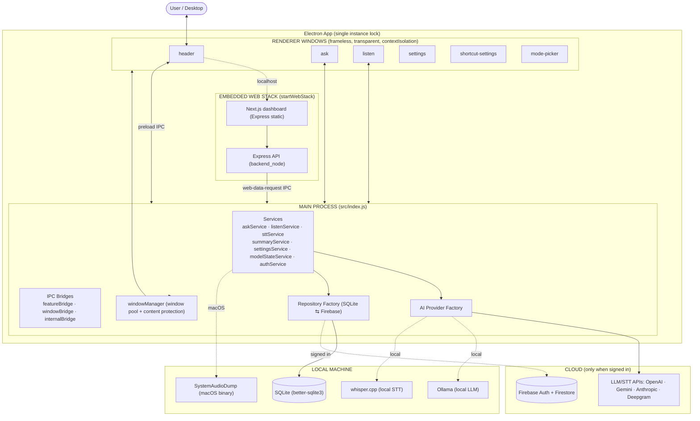

Notable startup details in `index.js`:

- **Single-instance lock** (`index.js:163`): a second launch focuses the existing window and
  forwards any `pickleglass://` deep link, then quits.
- The **Windows loopback grant** is installed before anything else in `whenReady`
  (`index.js:175-183`) — `session.defaultSession.setDisplayMediaRequestHandler` answers every
  `getDisplayMedia` request with the first screen source and `audio: 'loopback'`.
- The web stack is started **before** windows are created (`index.js:218-222`), because the
  header window loads UI that expects the API to exist.

---

## 3. The window model & "invisibility"

Every window is held in a single `Map` called `windowPool` (`windowManager.js:35`). They share
`commonChildOptions` (`windowManager.js:481-496`): `frame:false`, `transparent:true`,
`alwaysOnTop:true`, `skipTaskbar:true`, `hiddenInMissionControl:true`, and
`setVisibleOnAllWorkspaces(true, {visibleOnFullScreen:true})`.

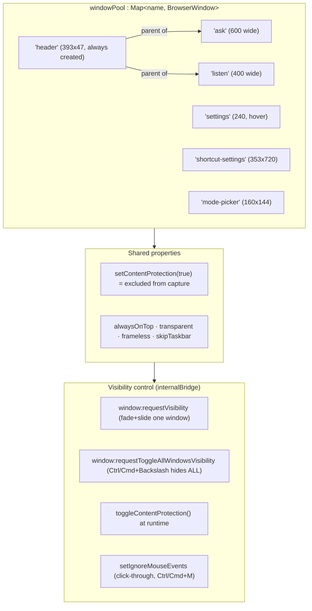

**The invisibility mechanism.** `isContentProtectionOn` defaults to `true`
(`windowManager.js:31`). Every window calls `setContentProtection(isContentProtectionOn)` at
creation (e.g. `windowManager.js:507`, `:538`, `:801`), and `setContentProtection`
(`windowManager.js:451-459`) re-applies it to the whole pool when toggled. Electron's content
protection tells the OS compositor to exclude the window from screen capture, so Glass does not
appear in screen recordings, screenshots, or screen-shares — while remaining visible on your
physical display. There's no "always-on capture" or hidden upload; the only screen grab is the
single on-demand Ask screenshot (§6).

**Lifecycle of feature windows.** Only `header` is created up front. The feature windows are
created when the header transitions to the `'main'` state (after API key / login) and destroyed
when it returns to `'apikey'`/`'permission'` (`handleHeaderStateChanged`,
`windowManager.js:859-869`; `createFeatureWindows` / `destroyFeatureWindows`,
`windowManager.js:478-701`). Position and motion are handled by `WindowLayoutManager`
(child layout relative to the header) and `SmoothMovementManager` (animated move/fade/resize).

On macOS 26+ an optional native dependency `electron-liquid-glass` adds the "Liquid Glass"
material (`windowManager.js:11-28`); it's a no-op everywhere else.

---

## 4. IPC architecture

Renderers run with `contextIsolation:true` and `nodeIntegration:false` — they have no Node or
DB access. Everything crosses the process boundary through three bridges plus the preload.

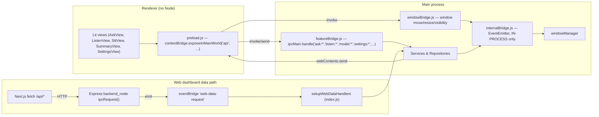

- **`preload.js`** exposes a namespaced, audited surface on `window.api` — `platform`,
  `common`, plus per-view objects like `askView`, `listenCapture`, `settingsView`, `mainHeader`
  (`preload.js:4-324`). Renderers call `ipcRenderer.invoke(...)`; they never see `require`.
- **`featureBridge.js`** registers all the feature `ipcMain.handle(...)` endpoints and
  fans service events back out to every window (`featureBridge.js:16-290`).
- **`windowBridge.js`** handles window geometry/visibility invokes.
- **`internalBridge.js`** is an in-process `EventEmitter` (`internalBridge.js`) used between
  services and `windowManager` — e.g. `internalBridge.emit('window:requestVisibility', …)`. It
  never touches the renderer.
- **Web dashboard round-trip**: the Express backend cannot read SQLite directly. It emits
  `web-data-request` over an `eventBridge`, and `setupWebDataHandlers` (`index.js:317-445`)
  services it via the same repositories, replying on a unique response channel. (See
  `docs/DESIGN_PATTERNS.md §II` for the sequence.)

---

## 5. App lifecycle

```mermaid
sequenceDiagram
    autonumber
    participant App as Electron app
    participant DB as databaseInitializer
    participant Auth as authService
    participant Model as modelStateService
    participant Web as startWebStack
    participant Win as windowManager
    App->>App: requestSingleInstanceLock() / setupProtocolHandling()
    Note over App: app.whenReady()
    App->>App: setDisplayMediaRequestHandler (Windows loopback grant)
    App->>App: initializeFirebase()
    App->>DB: initialize() — SQLite + schema/migrations
    App->>Auth: initialize() — onAuthStateChanged (default_user until login)
    App->>Model: initialize() — encryption, migrations, auto-select models
    App->>App: featureBridge + windowBridge initialize; ollama warm-up (bg)
    App->>Web: startWebStack() — free ports, Express API + Next.js static
    App->>Win: createWindows() — header, then feature windows if state='main'
    Note over App: app.on('before-quit') graceful shutdown
    App->>App: listenService.closeSession() (kill SystemAudioDump)
    App->>DB: endAllActiveSessions() + databaseInitializer.close()
    App->>App: app.exit(0)
```

Startup is `index.js:172-242`; graceful shutdown is `index.js:244-309` and is careful to stop
audio capture, end DB sessions, race Ollama shutdown against an 8 s timeout, and close DB
connections before exiting.

---

## 6. The Ask (vision) feature

**Trigger:** `Ctrl/Cmd + Enter` (`nextStep` keybind, `shortcutsService.js:68`,`:213-214`) →
`askService.toggleAskButton(true)` → `askService.sendMessage(...)` (`askService.js:219`).

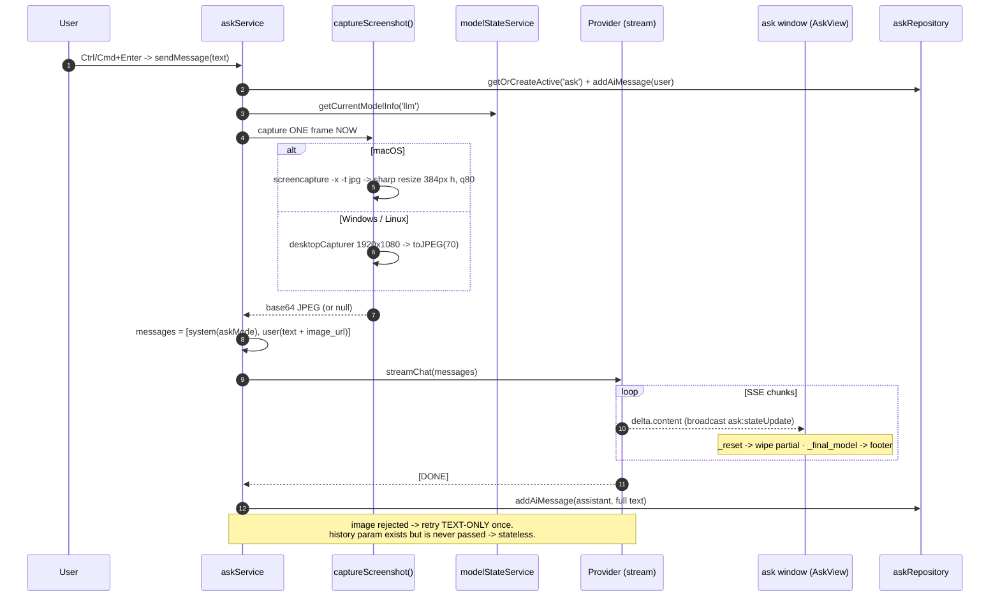

Key behaviors, all in `askService.js`:

1. **Screenshot capture** (`captureScreenshot`, `:39-121`):
   - **macOS** → native `screencapture -x -t jpg`, then `sharp` resize to **384 px height**,
     JPEG **quality 80** (`:44-67`). If `sharp` is unavailable it falls back to the raw image
     (`:73-84`).
   - **Windows / Linux** → Electron `desktopCapturer.getSources` at **1920×1080**, then
     `thumbnail.toJPEG(70)` (`:91-113`).
   - The image is base64-encoded and attached inline as a multimodal `image_url` part
     (`:301-306`).
2. **Prompt assembly** (`:259-299`): the system prompt is chosen by **Ask mode** (§13) —
   `default`, `code`, `debug`, or `system_design` — read from settings; `code` mode injects the
   preferred language token.
3. **Streaming** via `createStreamingLLM(provider, …)` (`:308-314`); SSE chunks are parsed in
   `_processStream` (`:401-474`) and broadcast to `AskView` over `ask:stateUpdate`. It also
   honors the Gemini failover sentinels `_reset` and `_final_model` (`:425-439`, see §10).
4. **Persistence**: the user prompt and the assistant response are written to `ai_messages`
   tied to the `'ask'` session (`:246`, `:467`).
5. **Multimodal fallback** (`:335-370`): if the provider rejects the image (`_isMultimodalError`
   heuristic, `:480-492`), the request is retried **text-only**, once.

**Statelessness (important).** `sendMessage(userPrompt, conversationHistoryRaw=[])` would format
the last 30 turns (`_formatConversationForPrompt`, `:207-212`) — but the IPC handlers
`ask:sendQuestionFromAsk` and `ask:sendQuestionFromSummary` call it with **only the prompt**
(`featureBridge.js:134`, `:143`). So the LLM gets *system prompt + your text + one screenshot*
and nothing else. No prior questions, answers, or screenshots are replayed.

---

## 7. The Listen (audio / STT) feature

> The authoritative deep-dive is [`docs/AUDIO_AND_STT.md`](docs/AUDIO_AND_STT.md). This section
> is the architectural summary.

Glass runs **two independent STT sessions** created in parallel at listen start
(`sttService.js:469-472`) and tags each transcript by **the channel it arrived on** — this is
**source attribution, not voice diarization** (see [§0](#0-tldr--the-questions-everyone-asks-first)).

### 7.1 Capture pipeline (dual channel)

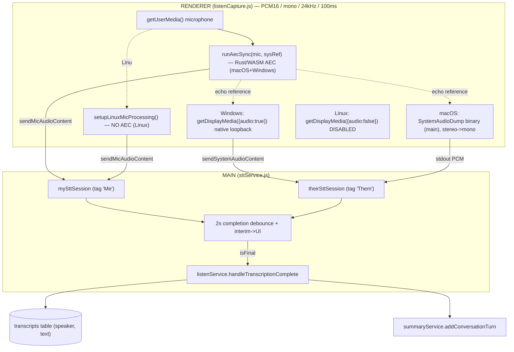

- Capture is orchestrated in the renderer by `startCapture` (`listenCapture.js:417`), which
  branches per platform. Audio is normalized everywhere to **PCM16, mono, 24 kHz, 100 ms chunks**.
- **Windows** captures both mic (`getUserMedia`) and system audio (`getDisplayMedia({audio:true})`
  → native loopback) separately (`listenCapture.js:515-565`).
- **macOS** captures mic via `getUserMedia` and system audio via the spawned `SystemAudioDump`
  binary in the main process (`sttService.js:630-721`), which is `darwin`-gated (`:631`).
- **Linux** disables system audio (`getDisplayMedia({audio:false})`, `listenCapture.js:488`) —
  mic only.
- **AEC** (acoustic echo cancellation) runs the mic through a Rust/WASM module
  (`runAecSync`, `listenCapture.js:134`) on macOS and Windows, using the system-audio stream as
  the echo reference so the other party's voice leaking from your speakers isn't double-counted
  onto `"Me"`. The Rust source is the `aec` git submodule (`.gitmodules` → `samtiz/aec.git`);
  the runtime glue is `src/ui/listen/audioCore/aec.js`. If the WASM isn't loaded, `runAecSync`
  returns the mic audio unchanged (`listenCapture.js:135`) — graceful degradation.

### 7.2 Speaker attribution (not diarization)

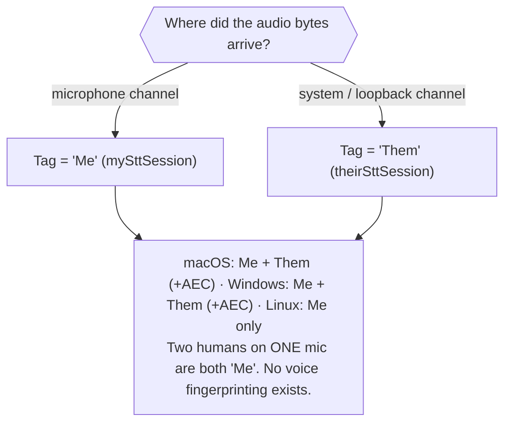

### 7.3 STT session lifecycle & resilience

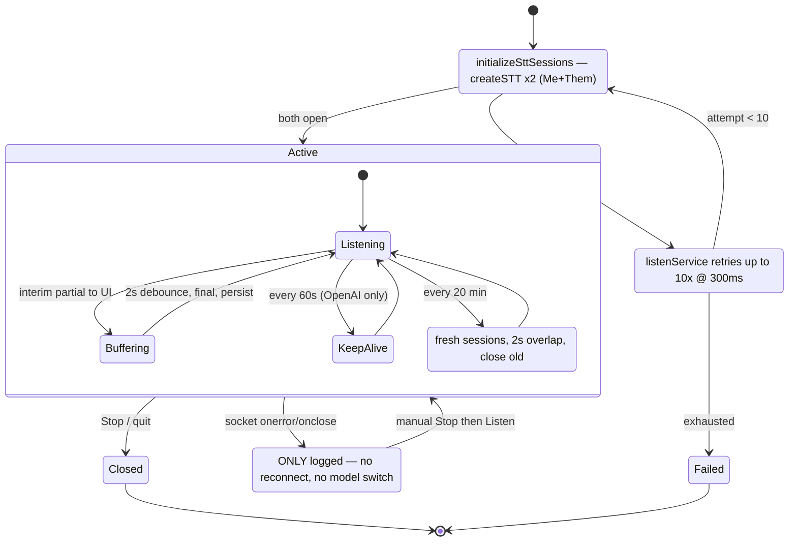

- **Init retry**: up to **10×** at 300 ms on listen start (`listenService.js:174-194`).
- **Keep-alive**: every **60 s**, OpenAI only (`sttService.js:478`, `:501-512`); Gemini's SDK
  self-heartbeats.
- **Proactive renewal**: every **20 min** both sessions are recreated with a **2 s overlap** so
  no audio is dropped, dodging provider hard timeouts (`sttService.js:482-491`, `renewSessions`
  `:518-545`).
- **Debounce**: finalized utterances flush through a **2 s** debounce (`COMPLETION_DEBOUNCE_MS`,
  `sttService.js:6`) before being persisted and summarized.
- **No STT failover** — by design (see §10). A socket that drops mid-session is **only logged**
  (`sttService.js:443-444`, `:452-453`); recovery requires a manual Stop → Listen.

Each finalized utterance lands in the `transcripts` table tagged with `session_id`, `speaker`,
`text`, `start_at` (`listenService.saveConversationTurn`, `:109-127`).

---

## 8. Incremental summarization

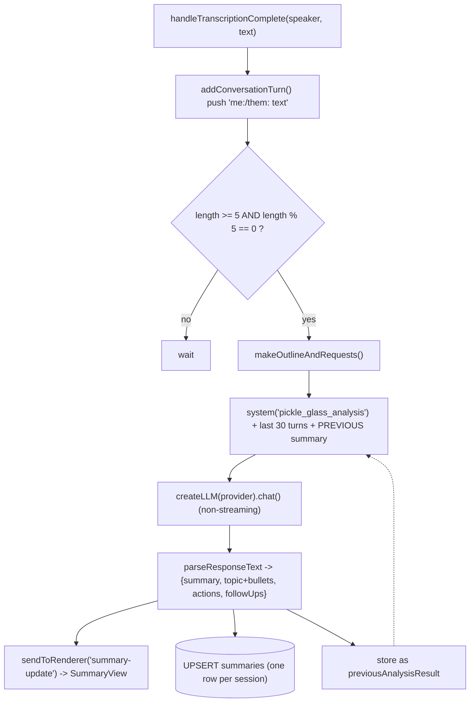

`summaryService.js` fires analysis every time the turn count hits a multiple of 5
(`triggerAnalysisIfNeeded`, `:305-306`). Each run feeds the **previous analysis result** plus
the **last 30 turns** back into the prompt (`:65-68`, `:82-94`), so summaries build forward
rather than restarting. The structured output (TLDR, topic bullets, action items, suggested
follow-ups) is parsed (`parseResponseText`, `:189-300`), pushed to `SummaryView`, and **UPSERT**ed
into the `summaries` table — one row per `session_id` (`:157-164`).

---

## 9. AI provider abstraction & model state

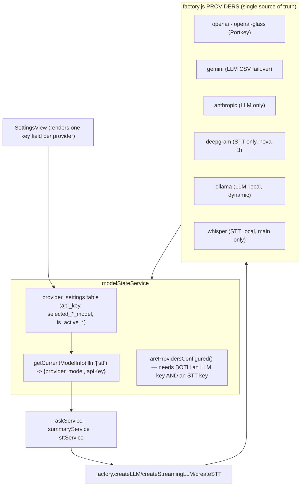

- The **registry** `PROVIDERS` (`factory.js:20-96`) declares each provider's `llmModels` and
  `sttModels`. The factory exposes `createSTT` / `createLLM` / `createStreamingLLM`
  (`factory.js:102-139`), normalizing the `-glass` suffix via `sanitizeModelId` (`:98-100`).
- **`modelStateService`** is the single arbiter of *which* model and key are live. It stores
  keys + selections in the `provider_settings` table, auto-selects a valid model when keys
  change (`_autoSelectAvailableModels`, `:142-179`), maps a model ID back to its provider
  (`getProviderForModel`, `:286-311`), and returns the runtime triple via `getCurrentModelInfo`
  (`:377-389`).
- **Configuration gate**: `areProvidersConfigured` (`:437-455`) requires **both** a working LLM
  key and a working STT key — so an STT-only provider (Deepgram) or LLM-only provider
  (Anthropic/Ollama) can't satisfy the app alone.

| Provider | LLM | STT | Notes |
|---|---|---|---|
| OpenAI | ✅ `gpt-4.1` | ✅ `gpt-4o-mini-transcribe` | Realtime STT; 60 s keep-alive |
| OpenAI (Glass) | ✅ | ✅ | Pickle-hosted key via Portkey |
| Gemini | ✅ `gemini-2.5-flash` | ✅ `gemini-live-2.5-flash-preview` | LLM supports CSV failover; STT does not |
| Anthropic | ✅ `claude-3-5-sonnet` | ❌ | LLM only |
| Deepgram | ❌ | ✅ `nova-3` | STT only (pinned to nova-3) |
| Whisper (local) | ❌ | ✅ tiny/base/small/medium | Main process only |
| Ollama (local) | ✅ (dynamic) | ❌ | LLM only |

---

## 10. Gemini failover

A headline feature of this fork (full design in
[`specs/2026-05-26-gemini-failover-design/`](specs/2026-05-26-gemini-failover-design/)). The
Gemini LLM model field accepts a **comma-separated priority list** (e.g.
`gemini-3-pro,gemini-2.5-flash,gemini-2.5-flash-lite`). On a *transient* error the current model
is cooled down and the next is tried; the model that actually answered is shown in a per-response
footer (`answered by: <model>`, with `(fallback)` if a retry occurred).

```mermaid
flowchart TB
    start(["createStreamingLLM / createLLM with model CSV"]) --> parse["parseModelList(csv) -> remaining[]"]
    parse --> pick["pickModel: first healthy; else soonest-to-recover"]
    pick --> call["attempt model"]
    call --> ok{"success?"}
    ok -->|yes| done["markSucceeded; emit _final_model footer"] --> finish(["[DONE]"])
    ok -->|error| classify["classifyError: status -> errorDetails -> message"]
    classify --> kind{"kind?"}
    kind -->|fatal-auth 401/403| fatal["surface immediately"]
    kind -->|fatal-request 400| fatal
    kind -->|transient 408/429/5xx, network| cool["markFailed(model, parseRetryAfter) cooldown 5s..300s"]
    cool --> reset["streaming: emit {_reset, next_model} -> consumer wipes partial"]
    reset --> more{"models left?"}
    more -->|yes| pick
    more -->|no| allfail["controller.error(lastErr)"]
```

- The health registry is an **in-memory singleton** `Map` (`geminiModelRotator.js:14`) — one
  shared rate-limit view per process; it resets on restart (cooldowns are clamped to ≤ 300 s, so
  nothing meaningful is lost).
- `classifyError` (`geminiModelRotator.js:95-131`) inspects HTTP status → `errorDetails[]`
  `ErrorInfo.reason` → message-text heuristics, defaulting **fail-open** to `transient` so the
  loop keeps trying on unknown errors. `transient` = 408/429/5xx, network, `RESOURCE_EXHAUSTED` /
  `UNAVAILABLE` / `DEADLINE_EXCEEDED`; `fatal-request` = 400/`INVALID_ARGUMENT` (catches CSV
  typos); `fatal-auth` = 401/403/`API_KEY_INVALID`.
- Cooldown honors `Retry-After` / `retryDelay`, defaults to 60 s, clamped to `[5 s, 300 s]`
  (`parseRetryAfter`, `:149-192`; constants `:16-18`).
- **Streaming** emits a `_reset` sentinel so the Ask consumer discards the partial answer before
  the next model streams in, then a `_final_model` sentinel (`gemini.js:335-382`); the Ask SSE
  parser handles both (`askService.js:425-439`).
- **STT deliberately does NOT fail over** — `createSTT` takes only the first model in the list
  (`gemini.js:38-40`), because a persistent live STT session has no clean rotation semantics
  (locked decision #3 in the spec).

---

## 11. Data, persistence & auth

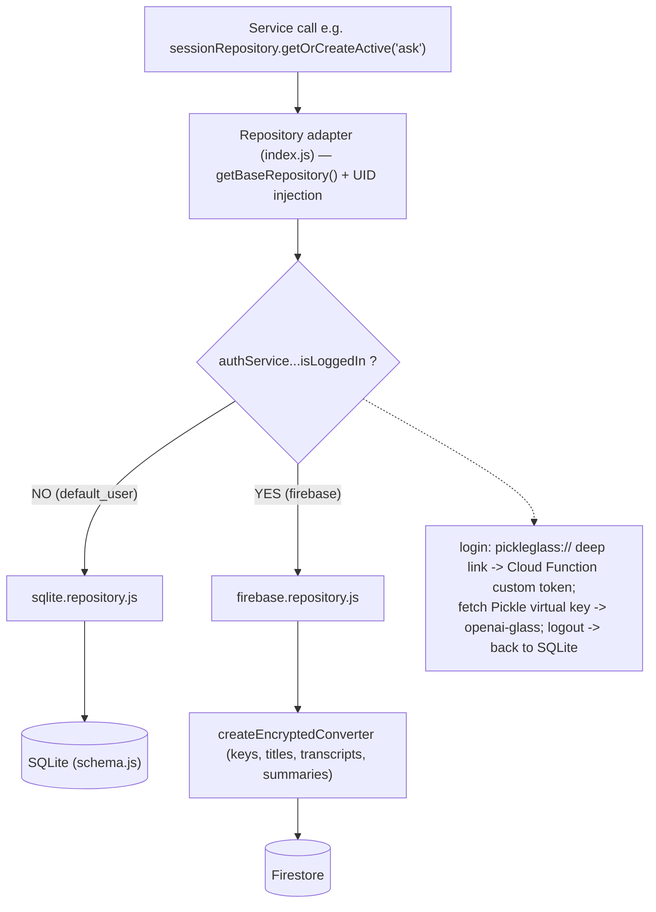

- **Dual repository pattern**: each user-data domain (`session`, `ask`, `stt`, `summary`,
  `user`, `preset`, `providerSettings`, …) has a `sqlite.repository.js` and a
  `firebase.repository.js` behind an `index.js` **adapter** (`repositories/session/index.js`).
  The adapter checks `authService.getCurrentUser().isLoggedIn` per call (`:10-21`) to pick the
  store, and injects the `uid` so services never handle user IDs.
- **Auth/storage switch**: `authService` starts as `default_user` in `'local'` mode
  (`authService.js:40-41`). `onAuthStateChanged` (`:51-126`) flips to `'firebase'` on login,
  fetches a **Pickle virtual key** by email and wires it as the `openai-glass` provider via
  `modelStateService.setFirebaseVirtualKey`, and reverts to local on logout. Sign-in itself is a
  `pickleglass://` deep link → Cloud Function (`pickleGlassAuthCallback`) → custom token
  (`index.js:498-562`).
- **Encryption**: when persisting to Firebase, API keys, titles, transcripts, and summaries are
  encrypted via a Firestore converter (`encryptionService` + `firestoreConverter.js`); see
  `docs/DESIGN_PATTERNS.md` principle #6.
- **Schema** (`schema.js`, single source of truth) — the tables that matter:

```
sessions          (id, uid, title, session_type, started_at, ended_at, sync_state, updated_at)
transcripts       (id, session_id, start_at, end_at, speaker, text, lang, ...)   -- Listen STT
ai_messages       (id, session_id, sent_at, role, content, tokens, model, ...)   -- Ask Q&A
summaries         (session_id PRIMARY KEY, text, tldr, bullet_json, action_json, model, ...)
provider_settings (provider PK, api_key, selected_llm_model, selected_stt_model, is_active_*)
prompt_presets · shortcuts · ollama_models · whisper_models · users · permissions
```

---

## 12. Local AI (Ollama + Whisper)

Glass can run fully local — no cloud, no API key:

- **Ollama** (local LLM) is managed by `ollamaService` + `localAIManager`. Models are tracked
  in the `ollama_models` table; the selected model is warmed up in the background at startup
  (`index.js:209-216`) and on selection (`modelStateService.js:342-344`). Ollama's `llmModels`
  list in the registry is empty and **populated dynamically** from installed models
  (`factory.js:71`, `modelStateService.getAvailableModels` `:360-362`).
- **Whisper** (local STT) runs **only in the main process** — the factory returns a stub in the
  renderer (`factory.js:74-95`). Models (tiny/base/small/medium) are downloaded with SHA-256
  verification from the manifest in `checksums.js`. STT output is filtered for noise tokens like
  `[BLANK_AUDIO]` (`sttService.js:175-205`).
- `localAIManager` periodically syncs service health and, if a local service goes down,
  `modelStateService` auto-reselects another available model
  (`handleLocalAIStateChange`, `:104-123`).

---

## 13. Prompts & Ask modes

Prompt text lives in `promptTemplates.js` (`profilePrompts`) and is assembled by
`promptBuilder.getSystemPrompt(profile, history, …)`. Ask has **four modes**, chosen from the
`mode-picker` window and stored in settings (`featureBridge.js:82` `VALID_ASK_MODES`):

| Ask mode | Prompt profile | Purpose |
|---|---|---|
| `default` | `pickle_glass_analysis` | General live co-pilot — answer the question / define the term / solve what's on screen |
| `code` | `pickle_glass_code` | Coding-interview solution: code + reasoning + time/space complexity (honors preferred language) |
| `debug` | `pickle_glass_debug` | Debug the code in the screenshot: issues, fixes, optimizations |
| `system_design` | `pickle_glass_system_design` | Staff-level system-design co-pilot: 12-section phased design with numbers |

The Listen summary uses the `pickle_glass_analysis` profile with a `{{CONVERSATION_HISTORY}}`
token. The `default` analysis profile encodes a strict decision hierarchy (answer recent
question → define proper noun → solve on-screen problem → passive acknowledgment) so the model
behaves predictably on noisy meeting transcripts (`promptTemplates.js:238-403`).

> Note: `ask:sendQuestionFromSummary` (the Listen "suggested action" buttons) only works in
> `default` mode and is rejected in the other modes (`featureBridge.js:135-144`).

---

## 14. Build, packaging & platform support

- **Renderer build**: `build.js` (esbuild) bundles the Lit views; `npm run build:renderer`.
- **Web build**: `npm run build:web` builds the Next.js dashboard into `pickleglass_web/out`,
  copied into app resources (`electron-builder.yml` `extraResources`).
- **Packaging** is `electron-builder` (`electron-builder.yml`):
  - **macOS** → `dmg` + `zip`, **universal** (Intel + Apple Silicon), hardened runtime,
    `entitlements.plist`, min macOS 11.
  - **Windows** → `nsis` installer + `portable`, **x64**, code-signed.
  - **Linux** → **no target defined** (you run it from source).
  - The macOS `SystemAudioDump` binary and `sharp` are `asarUnpack`'d (`electron-builder.yml:35-37`)
    so they can execute from outside the asar archive.
- **Deep linking**: registers the `pickleglass://` protocol for the auth callback.
- **Auto-update**: `electron-updater` checks GitHub releases in production (`index.js:697-728`).

The `SystemAudioDump` binary (~179 KB) is committed under `src/ui/assets/` and is a macOS Mach-O
executable — it is never spawned on Windows/Linux (`sttService.js:631`).

---

## 15. "If I run it as-is"

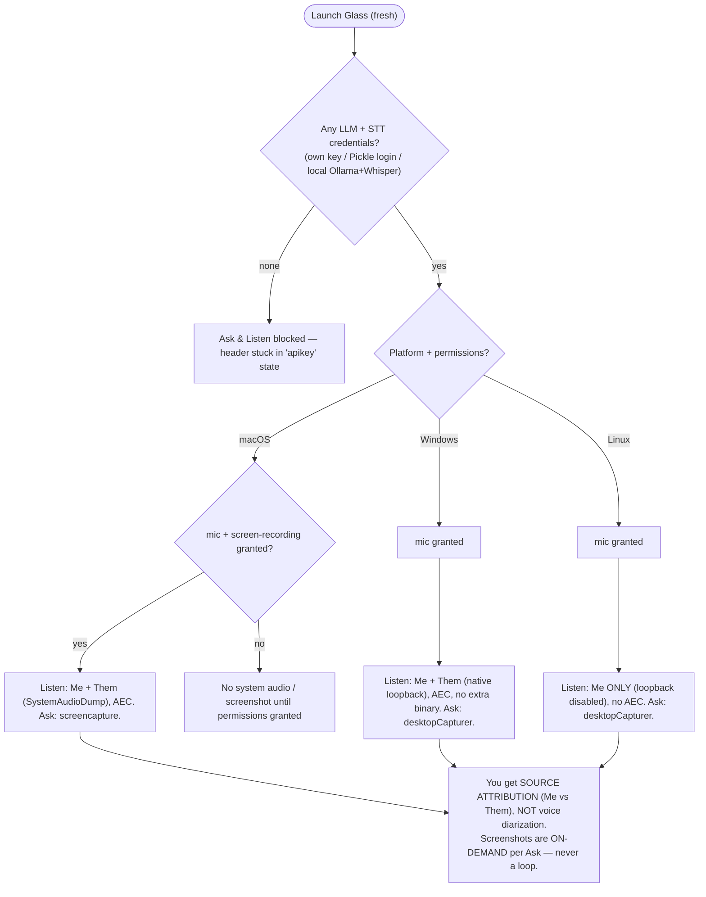

So, concretely, on first launch:

1. **You must provide credentials first.** Easiest "free" path is signing in with Pickle
   (hosted OpenAI key via Portkey); the offline path is installing Ollama + downloading a
   Whisper model. With your own keys, paste them in Settings.
2. **Grant OS permissions** (microphone everywhere; on macOS also screen recording for system
   audio + screenshots; macOS also prompts for Keychain to store the encryption key).
3. **Then** Ask works on all three platforms, and Listen gives you the two-channel `"Me"`/`"Them"`
   split on macOS and Windows (one channel on Linux). What you will **not** get on any platform
   is voice-based diarization — the split is purely by audio source.

---

## 16. Known limitations & gotchas

- **Listen → Ask context is not wired.** `listenService.getConversationHistory()` exists
  (`listenService.js:266`) but no path passes the live transcript into `askService.sendMessage`.
  Pressing Ask during a meeting sends only your text + the current screenshot, not the
  conversation. Wiring it is a small change in `featureBridge.js`.
- **Ask is stateless across presses** (§6) — by current wiring, not a model limitation.
- **No STT failover / no reconnect-on-drop** (§7.3, §10) — a dropped live STT socket is logged,
  not recovered; the only resilience is the timed 20-min renewal and OpenAI keep-alive.
- **Diarization is source attribution** (§0/§7.2) — two people on one mic are both `"Me"`.
- **Linux has no system audio and no prebuilt binary** — mic-only, run from source.
- **Deepgram STT is pinned to `nova-3`** regardless of registry entries
  (see `docs/AUDIO_AND_STT.md §4`).
- **Vestigial `screenshotInterval`** in settings/`startCapture` is unused — there is no periodic
  screenshot loop.
- **`captureManualScreenshot`** (the `Ctrl/Cmd+Shift+S` keybind, `shortcutsService.js:253-258`)
  calls `window.captureManualScreenshot`, which is not actually exported by `listenCapture.js`
  — effectively a dead path today.

---

## 17. File map — where to look

| Area | Start here |
|---|---|
| App entry / lifecycle / web stack / deep links | `src/index.js` |
| Windows, invisibility, layout | `src/window/windowManager.js`, `windowLayoutManager.js`, `smoothMovementManager.js` |
| IPC | `src/preload.js`, `src/bridge/{featureBridge,windowBridge,internalBridge}.js` |
| Ask (vision) | `src/features/ask/askService.js`, `src/ui/ask/AskView.js` |
| Listen (audio/STT) | `src/features/listen/listenService.js`, `stt/sttService.js`, `src/ui/listen/audioCore/listenCapture.js` |
| Summarization | `src/features/listen/summary/summaryService.js` |
| AI providers / factory | `src/features/common/ai/factory.js`, `ai/providers/*.js` |
| Gemini failover | `ai/providers/gemini.js`, `ai/providers/geminiModelRotator.js` |
| Model & key state | `src/features/common/services/modelStateService.js` |
| Auth / encryption | `src/features/common/services/{authService,encryptionService,migrationService}.js` |
| Persistence | `src/features/common/repositories/**`, `src/features/common/config/schema.js` |
| Local AI | `src/features/common/services/{ollamaService,whisperService,localAIManager}.js` |
| Prompts / Ask modes | `src/features/common/prompts/{promptBuilder,promptTemplates}.js` |
| Web dashboard | `pickleglass_web/` |
| Packaging | `electron-builder.yml`, `build.js`, `entitlements.plist` |

---

*Generated by reverse-engineering the source at the current commit. Diagram sources:
[`docs/diagrams/`](docs/diagrams/). If you change a subsystem, update the matching section and
`.mmd` file together.*
