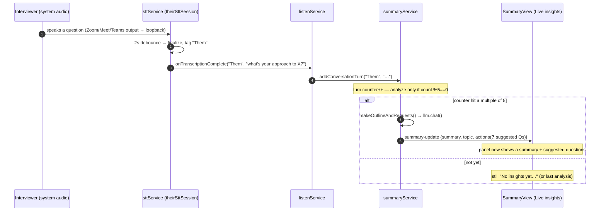

# Live Insights & Answer Generation

How Glass turns a live conversation into **Live Insights** (the panel that starts out saying
*"No insights yet…"*) and how it generates **answers** on demand. This picks up where
[`AUDIO_AND_STT.md`](AUDIO_AND_STT.md) ends (a finalized transcript turn) and complements the
architecture-level summaries in [`../ARCHITECTURE.md`](../ARCHITECTURE.md) §6 (Ask) and §8
(summarization). All claims carry `file:line` references to the current code.

---

## 1. The mental model: two assistants, not one

Glass helps a live conversation in **two independent ways**. Keeping them straight is the key
to understanding the interview scenario in §5.

| | **Live Insights** (Listen) | **Ask** |
|---|---|---|
| Trigger | Automatic, while listening | On-demand (hotkey / typing / clicking a suggestion) |
| Sees the audio transcript? | **Yes** — built *from* the transcript | **No** — transcript is never passed (§4) |
| Sees the screen? | No | **Yes** — one fresh screenshot per press |
| Cadence | Every **5th** finalized turn | Once per request |
| LLM call | `llm.chat()` (non-streaming) | `streamChat()` (streaming) |
| Output | Structured panel: Summary / Topic / Actions | Free-form streamed markdown answer |
| Engine | `summaryService.js` | `askService.js` |
| UI | `SummaryView` (the "Live insights" tab) | `AskView` (separate window) |

> **The one-sentence version:** *Live Insights is the only part of Glass that actually "hears"
> the interviewer. Ask answers what you type or what's on your screen — it does not hear the
> room.* The bridge between them (§3.5, §5) is the clickable suggestion in the insights panel.

---

## 2. From transcript to insights — the handoff

Each finalized utterance (after the 2 s completion debounce — see
[`AUDIO_AND_STT.md` §1](AUDIO_AND_STT.md)) fires the STT callback, which `listenService`
forwards two places at once (`listenService.js:99-107`):

```
sttService  ──onTranscriptionComplete(speaker, text)──►  listenService.handleTranscriptionComplete
                                                              │
                                       ┌──────────────────────┴───────────────────────┐
                                       ▼                                               ▼
                          sttRepository.addTranscript()                 summaryService.addConversationTurn()
                          (persist to `transcripts` table)              (feed the Live Insights engine)
                          listenService.js:118                          listenService.js:106
```

So **every** `"Me"`/`"Them"` turn that lands in the transcript is also pushed into the insights
engine as a string `"me: …"` / `"them: …"` (`summaryService.js:38-46`).

---

## 3. Live Insights — the "No insights yet…" panel

### 3.1 What the panel is

The Listen window opens on the **"Live insights"** view by default (`ListenView.js:436`,
label at `:632`), with a toggle button to **"Show Transcript"** / **"Show Insights"**
(`ListenView.js:546-549`, `:642-658`). The insights view is the `SummaryView` Lit component
(`src/ui/listen/summary/SummaryView.js`); the transcript view is `SttView`.

### 3.2 Why it says "No insights yet…"

`SummaryView` shows that placeholder whenever it has **no structured content to render**
(`SummaryView.js:466-471`):

```js
const hasAnyContent = data.summary.length > 0
                   || data.topic.bullets.length > 0
                   || data.actions.length > 0;
// …
${!hasAnyContent
    ? html`<div class="empty-state">No insights yet...</div>`
    : html` … render Summary / Topic / Actions / Follow-Ups … `}
```

The component starts with empty arrays (`SummaryView.js:244-249`) and is reset to empty at the
start of every new Listen session (`resetAnalysis()`, `:281-289`, called from
`ListenView.js:469`). So **"No insights yet…" is the normal state at the start of every
session** — it is not an error.

### 3.3 When it gets filled — the every-5-turns rule

Insights are produced by `summaryService.triggerAnalysisIfNeeded()`, which runs after **every**
conversation turn but only *fires an analysis* on multiples of 5 (`summaryService.js:305-306`):

```js
if (this.conversationHistory.length >= 5 && this.conversationHistory.length % 5 === 0) {
    const data = await this.makeOutlineAndRequests(this.conversationHistory);
    // …
    this.sendToRenderer('summary-update', data);   // → SummaryView updates
}
```

A "turn" is **one finalized utterance from either speaker** (mic *or* system audio, combined
into one running list). So:

| Finalized turns so far | What the panel shows |
|---|---|
| 0 – 4 | **"No insights yet…"** (engine is silent — below threshold) |
| **5** | First analysis appears (Summary / Topic / Actions) |
| 6 – 9 | Unchanged — still showing the turn-5 analysis |
| **10** | Refreshes, building on the previous analysis |
| 15, 20, 25 … | Refreshes again at each multiple of 5 |

**Practical consequence:** the panel stays on *"No insights yet…"* until the **5th finalized
utterance** of the session, then updates only once per 5 additional turns. A short exchange
(e.g. one question + one answer = 2 turns) may never cross the threshold. There is **no
manual "analyze now"** button — the cadence is purely turn-count driven.

> Throughput note: turns only count once STT finalizes them (after the 2 s debounce). Rapid
> back-and-forth fills the counter faster; long monologues count as a single turn until the
> speaker pauses.

### 3.4 What populates each section

`makeOutlineAndRequests()` (`summaryService.js:70-187`) builds the prompt and calls the LLM:

1. **Prompt** = the `pickle_glass_analysis` system profile with its `{{CONVERSATION_HISTORY}}`
   token replaced by the **last 30 turns** (`summaryService.js:93-94`,
   `formatConversationForPrompt`, `:65-68`), plus the **previous analysis** folded back in for
   continuity (`:82-91`), plus a hardcoded user message that requests this exact shape
   (`:116-134`):

   ```
   **Summary Overview**      → parsed into  data.summary[]    (≤5 bullets)
   **Key Topic: <name>**     → parsed into  data.topic.header + data.topic.bullets[] (≤3)
   **Extended Explanation**  → appended to  data.topic.bullets[]
   **Suggested Questions**   → parsed into  data.actions[] as "❓ <question>"
   ```

2. **LLM call** is **non-streaming** — `createLLM(provider).chat(messages)`
   (`summaryService.js:140-149`) — unlike Ask, which streams.

3. **Parse** — `parseResponseText()` (`:189-300`) turns the markdown into
   `{ summary, topic{header,bullets}, actions, followUps }` and always appends the default
   actions `"✨ What should I say next?"` and `"💬 Suggest follow-up questions"` (`:268-269`).

4. **Render + persist** — `sendToRenderer('summary-update', data)` (`:312`) updates the panel
   (`SummaryView.connectedCallback` → `onSummaryUpdate`, `:266-270`); the row is also UPSERTed
   into the `summaries` table (`:155-168`).

The rendered sections (`SummaryView.render`, `:455-547`):

| Panel section | Source field | Notes |
|---|---|---|
| **Current Summary** | `data.summary` | up to 5 bullets |
| **Key Topic: …** | `data.topic` | header + up to 3 bullets |
| **Actions** | `data.actions` | suggested questions + the two default prompts |
| **Follow-Ups** | `data.followUps` | only shown **after** the session ends (`hasCompletedRecording`, `ListenView.js:474`, `SummaryView.js:528`) |

### 3.5 Insights are clickable → they forward into Ask

Every summary / topic / action line is clickable. Clicking one calls
`handleRequestClick()` → `window.api.summaryView.sendQuestionFromSummary(text)`
(`SummaryView.js:406-425`, `preload.js:207`), which routes to
`ask:sendQuestionFromSummary` → `askService.sendMessage(text)` (`featureBridge.js:135-144`).
**This is the only built-in bridge from the transcript world into Ask** — and even then, only
the **clicked text** crosses over (see §4). It is **rejected unless Ask is in `default` mode**
(`featureBridge.js:136-142`); the error is surfaced to the user (`SummaryView.js:413-419`).

---

## 4. Ask — and why it does not hear the interviewer

The full Ask mechanics live in [`../ARCHITECTURE.md` §6](../ARCHITECTURE.md). The one fact that
matters most for the interview scenario:

> **Ask never receives the live transcript.** `askService.sendMessage(userPrompt,
> conversationHistoryRaw=[])` (`askService.js:219`) *can* accept conversation history and would
> format the last 30 turns (`_formatConversationForPrompt`, `:207-212`) — but **every** caller
> passes only the prompt: `ask:sendQuestionFromAsk` and `ask:sendQuestionFromSummary` both call
> `askService.sendMessage(userPrompt)` with no second argument (`featureBridge.js:134`, `:143`),
> and the screenshot-only path passes `[]` explicitly (`askService.js:154`).

So when you press Ask, the model receives exactly: **the system prompt + your typed text + one
fresh screenshot** (`askService.js:291-306`). It does **not** see what the interviewer just
said unless that text is on the screen or you typed/pasted it yourself. This is wiring, not a
model limitation — see [`../ARCHITECTURE.md` §16](../ARCHITECTURE.md) ("Listen → Ask context is
not wired").

**Two ways to actually submit an Ask:**

| Path | How | What's sent |
|---|---|---|
| Typed question | Type in the Ask box, press Enter (`AskView.js:1287-1299`, `:1301-1314`) | your text + screenshot |
| Screenshot-only | `Ctrl/Cmd+Enter` (`nextStep`) while the Ask box is open → `toggleAskButton(true)` → `sendMessage('', [])` (`shortcutsService.js:213-214`, `askService.js:148-156`) | empty text + screenshot only |

The screenshot-only path leans on the `pickle_glass_analysis` decision hierarchy: with no
typed question, the model falls through to **"solve the clear problem visible on screen"**
(`promptTemplates.js:362-372`) — ideal for a coding/LeetCode/system-design prompt that's on
screen.

---

## 5. Scenario: the interviewer asks a question — how do I get an answer?

Because Ask is transcript-blind (§4), there is no single "the interviewer spoke → Glass
auto-answers in Ask" path. Here is what actually happens and the proper flows to get an answer.

### 5.1 What happens automatically



So the interviewer's question lands in the **transcript** immediately, but it only influences
the **Live Insights** panel, and only when the turn count next hits a multiple of 5. The
insights `pickle_glass_analysis` profile is explicitly built to *answer a question at the end
of the transcript* (`promptTemplates.js:247-275`), so the panel's Summary/Actions often already
contain the gist of an answer and suggested replies.

### 5.2 The proper flows to get a usable answer

Pick based on what kind of question it is:

1. **Read the Live Insights panel (passive).** For discussion/behavioral questions, the panel's
   *Current Summary* + *Actions* ("❓ …", "✨ What should I say next?") frequently give you
   enough to respond. Caveat: throttled to every-5-turns (§3.3), and it's a summary, not a
   verbatim answer.

2. **Click a suggested question/action in the panel (bridge into Ask).** Clicking forwards that
   text into Ask (§3.5) and you get a fuller, streamed answer in the Ask window. Requires Ask to
   be in **`default` mode**. Note the answer is generated from *that clicked text + a fresh
   screenshot* — not the surrounding conversation.

3. **Type or paste the question into Ask (active, most direct).** Open Ask, type the question
   (or paste it), press Enter. This is the most reliable way to get a direct answer to a
   *specific* spoken question, because you're handing the model the exact text. Choose the Ask
   **mode** to match: `default` for general, `code` for a coding problem, `debug` to fix code on
   screen, `system_design` for a design prompt (`featureBridge.js:82`,
   [`../ARCHITECTURE.md` §13](../ARCHITECTURE.md)).

4. **Screenshot-only Ask (when the question is on the screen).** If the interviewer's prompt is
   visible (shared coding problem, design canvas, slide), press `Ctrl/Cmd+Enter` with the Ask
   box open to send just the screenshot (§4); the model solves what it sees.

### 5.3 Recommended interview setup

- **Run Listen for the whole session** so the transcript + insights build continuously (this is
  the only component that captures the interviewer). On **Windows and macOS** you get the clean
  *"Me"* vs *"Them"* split; on **Linux** the interviewer (system audio) is **not** captured at
  all (loopback disabled — [`AUDIO_AND_STT.md` §2](AUDIO_AND_STT.md)).
- **For spoken Q&A:** glance at Live Insights for the gist; for a specific answer, **type the
  question into Ask** (flow 3) or **click the matching suggested question** (flow 2).
- **For a coding / system-design prompt on screen:** put Ask in `code` / `system_design` mode
  and use **screenshot-only Ask** (flow 4).
- Keep Ask in **`default` mode** if you want the panel's clickable suggestions to work
  (flow 2) — they're blocked in the other modes.

---

## 6. Implementation notes & quirks (verified)

- **Insights never auto-open Ask.** A `summary-update` only repaints the panel; it never
  launches an answer. Producing an answer always requires one of the §5.2 user actions.
- **Stray template token in Ask `default` mode.** The Ask path builds the prompt with
  `getSystemPrompt('pickle_glass_analysis', conversationHistory, false)` (`askService.js:288`),
  which places the (empty) history in the *"User-provided context"* slot but does **not** replace
  the profile's trailing `{{CONVERSATION_HISTORY}}` token (`promptTemplates.js:402`) — only the
  *summary* path calls `.replace('{{CONVERSATION_HISTORY}}', …)` (`summaryService.js:94`). So in
  `default` Ask mode the literal string `{{CONVERSATION_HISTORY}}` reaches the model. Cosmetic
  today (models ignore it); it would matter if/when Listen→Ask history is wired.
- **Insights are non-streaming; Ask streams.** The panel updates in one shot per analysis
  (`summaryService.js:149`); Ask renders token-by-token (`askService._processStream`,
  `:401-474`).
- **One summary row per session.** The `summaries` table is UPSERTed, not appended
  (`summaryService.js:155-164`) — the panel reflects the latest rolling analysis, not a history.
- **Follow-Ups appear only after Stop.** They're gated on `hasCompletedRecording`
  (`ListenView.js:473-477`, `SummaryView.js:528`), so they show up once the session ends, not
  mid-conversation.

---

## 7. File map

| Concern | File |
|---|---|
| STT → transcript handoff | `src/features/listen/listenService.js` (`:99-127`) |
| Live Insights engine | `src/features/listen/summary/summaryService.js` |
| Live Insights UI ("No insights yet…") | `src/ui/listen/summary/SummaryView.js` |
| Listen window / insights-vs-transcript toggle | `src/ui/listen/ListenView.js` |
| Ask answer engine | `src/features/ask/askService.js` |
| Ask UI | `src/ui/ask/AskView.js` |
| Prompt profiles | `src/features/common/prompts/promptTemplates.js`, `promptBuilder.js` |
| IPC wiring | `src/bridge/featureBridge.js`, `src/preload.js` |
| Ask hotkey | `src/features/shortcuts/shortcutsService.js` (`:213-214`) |

---

*See also: [`AUDIO_AND_STT.md`](AUDIO_AND_STT.md) (capture → transcript),
[`../ARCHITECTURE.md`](../ARCHITECTURE.md) §6 (Ask), §8 (summarization), §13 (prompt profiles),
§16 (known limitations).*
